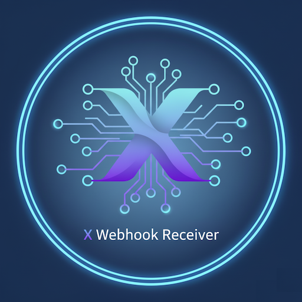

  <h1>UNRAID Applications</h1>
  
Production-ready Docker applications for UNRAID servers

  

    

      
      <h2>X Webhook Receiver</h2>
    

    
Universal webhook processing platform with support for UniFi Protect, GitHub, and custom webhooks. Transform, validate, and route webhook events with powerful mapping and alert capabilities.

    
    

      <h3>Key Features</h3>
      <ul>
        <li>🔔 UniFi Protect smart detection alerts</li>
        <li>🔄 Universal webhook transformation</li>
        <li>📊 Real-time event dashboard</li>
        <li>🔐 HMAC signature verification</li>
        <li>📱 SMS/Email notifications via AWS</li>
        <li>🗄️ PostgreSQL event storage</li>
      </ul>
    

    

      <a href="https://github.com/N85UK/UNRAID_APP" class="btn btn-primary">View Source</a>
      <a href="https://github.com/N85UK/UNRAID_APP/blob/main/templates/x-webhook-receiver.xml" class="btn btn-secondary">Install Template</a>
      <a href="https://forums.unraid.net/" class="btn btn-tertiary">Support Forum</a>
    

    

      Python
      FastAPI
      React
      PostgreSQL
    

  

  

    

      
      <h2>AWS Ultimate Messaging</h2>
    

    
Professional SMS/MMS messaging platform powered by AWS Pinpoint. Two-way messaging, contact management, conversation threading, and automated keyword responses for businesses.

    
    

      <h3>Key Features</h3>
      <ul>
        <li>💬 Two-way SMS/MMS messaging</li>
        <li>👥 Contact management system</li>
        <li>🧵 Threaded conversations</li>
        <li>🤖 Automated keyword responses</li>
        <li>📸 Media attachment support</li>
        <li>☁️ AWS Pinpoint integration</li>
      </ul>
    

    

      <a href="https://github.com/N85UK/UNRAID_APP" class="btn btn-primary">View Source</a>
      <a href="https://github.com/N85UK/UNRAID_APP/blob/main/templates/aws-ultimate-messaging.xml" class="btn btn-secondary">Install Template</a>
      <a href="https://forums.unraid.net/" class="btn btn-tertiary">Support Forum</a>
    

    

      Node.js
      Express
      React
      MySQL
      AWS Pinpoint
    

  

  <h2>Quick Installation</h2>
  

    

      
1

      <h3>Add Template Repository</h3>
      
In UNRAID, go to <strong>Docker → Add Container → Template repositories</strong>

      <code>https://github.com/N85UK/UNRAID_APP</code>
    

    
    

      
2

      <h3>Search & Install</h3>
      
Search for "X Webhook Receiver" or "AWS Ultimate Messaging" in the Apps tab

    

    
    

      
3

      <h3>Configure & Deploy</h3>
      
Fill in the required environment variables and deploy your container

    

  

  <h2>Support & Documentation</h2>
  

    

      <h3>📚 Documentation</h3>
      
Comprehensive guides and API documentation for each application

      <a href="https://github.com/N85UK/UNRAID_APP">View Docs</a>
    

    
    

      <h3>🐛 Bug Reports</h3>
      
Found an issue? Report bugs via GitHub Issues

      <a href="https://github.com/N85UK/UNRAID_APP/issues/new/choose">Report Issue</a>
    

    
    

      <h3>💬 Community</h3>
      
Join the discussion on UNRAID forums

      <a href="https://forums.unraid.net/">Forum</a>
    

    
    

      <h3>✨ Feature Requests</h3>
      
Suggest new features and improvements

      <a href="https://github.com/N85UK/UNRAID_APP/issues/new/choose">Request Feature</a>
    

  

<footer>
  
Built with ❤️ for the UNRAID community | <a href="https://github.com/N85UK">@N85UK</a>

  
Licensed under MIT | Docker images hosted on <a href="https://github.com/N85UK?tab=packages">GitHub Container Registry</a>

</footer>
